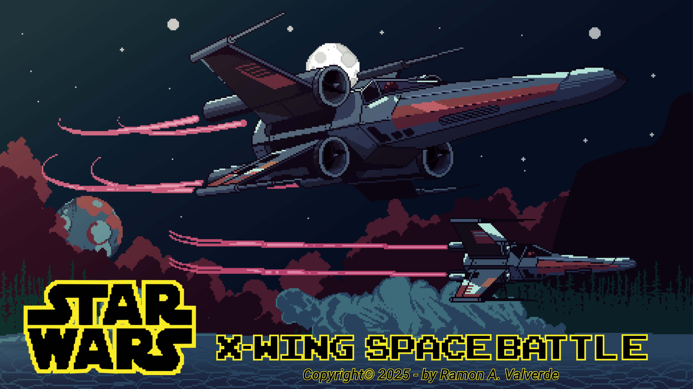

# X-Wing: Space Battle

### 🔗 [Clique aqui para jogar!](https://x-wing-battle-space.vercel.app/)

---

## 🚀 Sobre o Projeto

**X-Wing: Space Battle** é um jogo de combate espacial com estilo retrô, inspirado no universo de Star Wars. Desenvolvido inteiramente com **JavaScript puro (Vanilla JS)**, o projeto recria a emoção das clássicas batalhas de arcade, colocando você no controle de uma icônica nave X-Wing contra as forças do Império.

O jogo foi construído como um **Progressive Web App (PWA)**, o que significa que ele pode ser "instalado" em seu computador ou smartphone, funcionando de forma offline e proporcionando uma experiência imersiva em tela cheia, como um aplicativo nativo.

## ✨ Principais Funcionalidades

*   **Jogabilidade Arcade:** Enfrente hordas de Tie Fighters e prepare-se para batalhas épicas contra chefes, incluindo **Darth Vader** e a temível **Estrela da Morte**.
*   **Power-ups e Itens Especiais:** Colete itens para ganhar mais vida, escudos temporários e aumentar o poder de fogo da sua nave.
*   **Sistema de Pontuação e Tempo:** Desafie-se a bater seus próprios recordes de pontuação e tempo de sobrevivência.
*   **Experiência PWA Completa:** Instale o jogo no seu dispositivo para acesso rápido e jogue a qualquer momento, mesmo sem conexão com a internet.

## 🎮 Controles Multiplataforma

O jogo foi projetado para ser versátil e acessível em diversas plataformas:

*   **PC (Teclado):**
    *   **Setas Direcionais:** Movimentam a nave.
    *   **Barra de Espaço:** Atirar.
    *   **W, A, S, D:** Manobras especiais como Boost e rotação.
*   **PC (Controle):**
    *   Conecte um controle (testado com modelo Xbox) e o jogo o reconhecerá automaticamente, mapeando os comandos para uma experiência de console.
*   **Smartphone:**
    *   Um **gamepad virtual** aparece na tela, permitindo controle total através de um joystick e botões de ação sensíveis ao toque.

## 🔧 Tecnologias Utilizadas

Este projeto foi construído do zero, focando no uso de tecnologias web fundamentais, sem o uso de frameworks e API´s externas.

*   **HTML5:** Estrutura semântica do jogo.
*   **CSS3:** Estilização, animações e design responsivo.
*   **JavaScript (ES6+):** Toda a lógica do jogo, incluindo:
    *   Manipulação do DOM para renderização de elementos.
    *   **Gamepad API** para integração com controles físicos.
    *   Lógica de colisão, movimento e inteligência artificial dos inimigos.
*   **PWA (Progressive Web App):**
    *   **Service Worker:** Permite o funcionamento offline, armazenando os recursos do jogo em cache.
    *   **Web App Manifest:** Define os metadados para a instalação do app, como ícone, nome e orientação de tela.

## 🕹️ Como Jogar

1.  Acesse o **[link do jogo](https://x-wing-battle-space.vercel.app/)**.
2.  Use o teclado, controle ou a tela do seu smartphone para pilotar a X-Wing.
3.  Sobreviva o máximo que puder e destrua a Estrela da Morte para vencer!

4.  Para uma lista detalhada dos comandos, acesse o menu **Controles** na tela inicial.
